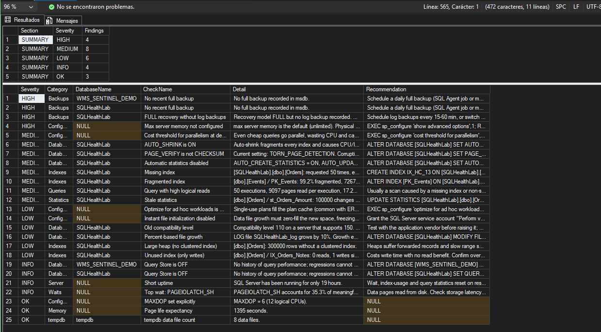
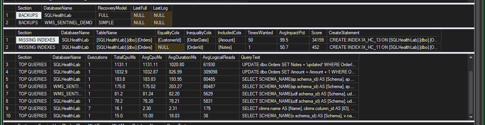

# SQL Server Health Check

A single read-only T-SQL script that audits a SQL Server instance in under a minute and returns a prioritized report: **what is wrong, why it matters, and the exact script to fix it**.

I built it for a recurring situation: a third-party ERP whose queries you cannot change, running slowly on SQL Server. When the vendor won't fix the application, the gains have to come from the database side. That means configuration, indexes, statistics, storage and maintenance.

## What it checks

| Area             | Checks                                                                                                                |
| ---------------- | --------------------------------------------------------------------------------------------------------------------- |
| Configuration    | Max server memory, MAXDOP, cost threshold for parallelism, optimize for ad hoc workloads, instant file initialization |
| tempdb           | Data file count vs CPUs, equal file sizes                                                                             |
| Database options | Auto-shrink, auto-close, page verify, automatic statistics, compatibility level, Query Store, percent file growth     |
| Backups          | Last full backup, FULL recovery without log backups                                                                   |
| Waits            | Top waits since startup, with a plain-language interpretation                                                         |
| Storage          | Read/write latency per data and log file                                                                              |
| Memory           | Page life expectancy, memory grants pending                                                                           |
| Indexes          | Missing indexes (with generated `CREATE INDEX`), fragmentation, unused indexes, large heaps                           |
| Statistics       | Stale statistics (≥ 20% rows modified)                                                                                |
| Queries          | Most expensive cached queries by CPU and reads                                                                        |
| Blocking         | Live blocking snapshot                                                                                                |

Every finding has a severity: **HIGH / MEDIUM / LOW / INFO / OK**.

## Safe by design

- **Read-only.** It only queries DMVs and catalog views. Nothing is changed.
- Fixes are **printed as scripts** for a human to review. Nothing runs automatically.
- Each database is analyzed in its own `TRY/CATCH`, so one failure doesn't stop the report.

## Usage

1. Open `sqlserver_healthcheck.sql` in SSMS.
2. Set the target databases:
   ```sql
   DECLARE @TargetDbs nvarchar(max) = N'MyErpDb,OtherDb'; -- NULL = all user databases
   ```
3. Run it with **Results to Grid**.

**Permissions:** `VIEW SERVER STATE`, `VIEW ANY DEFINITION`, read on `msdb`, and access to the target databases.

**Requirements:** SQL Server 2017 or later (2019, 2022 and 2025 are supported).

## Output

1. **SERVER**: version, edition, CPUs, RAM, uptime
2. **SUMMARY**: finding count per severity
3. **FINDINGS**: the prioritized report with recommendations
4. Detail result sets: **WAITS**, **IO**, **BACKUPS**, **MISSING INDEXES**, **TOP QUERIES**, **BLOCKING**





## Try it with the lab

`lab/01_create_lab.sql` creates `SQLHealthLab`, a demo database with deliberate problems: a large heap with no supporting index, an unused index, stale statistics, a fragmented GUID clustered index, auto-shrink, an old compatibility level and no backups. Run it, then run the health check to see every problem detected.

`lab/99_drop_lab.sql` removes the lab.

> Never run the lab script on a production server.

## Notes

- Wait, index-usage and plan-cache statistics reset when SQL Server restarts. Run the check after at least one full business day of activity.
- Treat missing-index suggestions as hints. Compare them with existing indexes before creating any.
- Changes to compatibility level or isolation level should be tested with the application vendor.

## License

MIT
